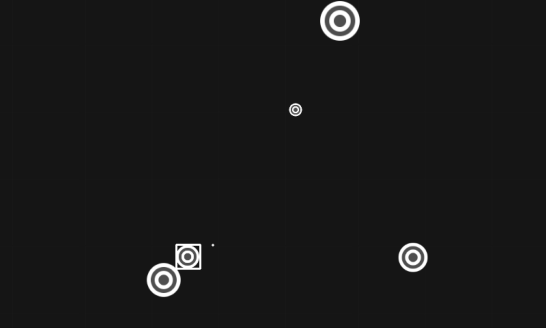

# aimtrainer.io bot
Bot para jogar o jogo [aimtrainer.io](https://aimtrainer.io/challenge), utilizando as bibliotecas OpenCV para
identificar a localização dos alvos na tela e o PyAutoGUI para clicar na tela. Acredito que com poucas modificações é
possível fazer o bot jogar os outros modos de jogo do site.


### Requisitos:
- [pyautogui](https://pyautogui.readthedocs.io/en/latest/): Automação do clique do mouse
- [opencv-python](https://docs.opencv.org/4.x/d6/d00/tutorial_py_root.html): Localização do alvo na tela
- [numpy](https://numpy.org/doc/): Usada em conjunto com o OpenCV
- [mss](https://python-mss.readthedocs.io): Screenshots rápidos
- [matplotlib](https://matplotlib.org/stable/api/index): Debug do programa

### Funcionamento

O bot faz várias capturas da tela do computador, de forma que a cada captura é executado um código que busca pela imagem
pré-definida do alvo. Assim que um alvo é localizado, o ponteiro do mouse navega até a localização definida e executa um
clique. A imagem abaixo mostra a identificação de um alvo no jogo contornado por um retângulo:



### Execução:
1. Preparar o script ```main.py``` para rodar, escolhendo o número de pontos, tamanho do alvo em pixels e a resolução 
da tela;
2. Entrar no site [aimtrainer.io](https://aimtrainer.io/challenge), clicar em "Play";
3. Executar o script ```main.py``` enquanto o jogo estiver em contagem regressiva;
4. Deixar a tela do jogo totalmente visível para o bot funcionar corretamente.